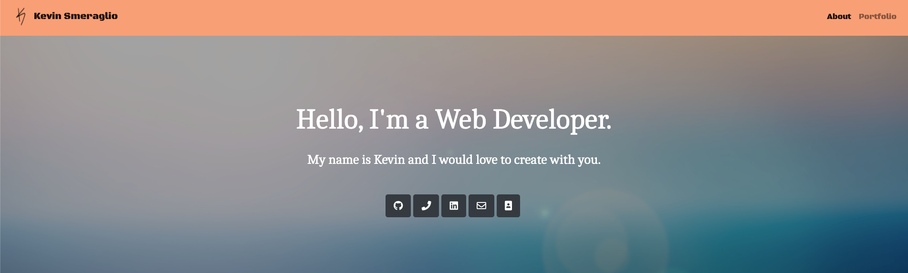
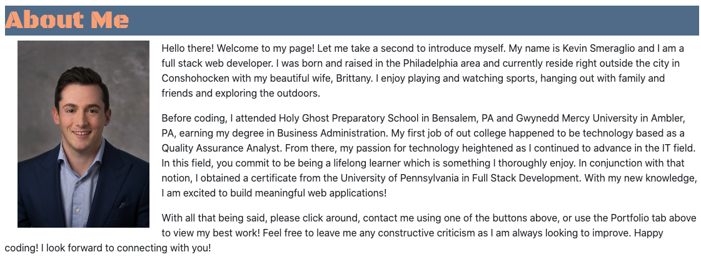
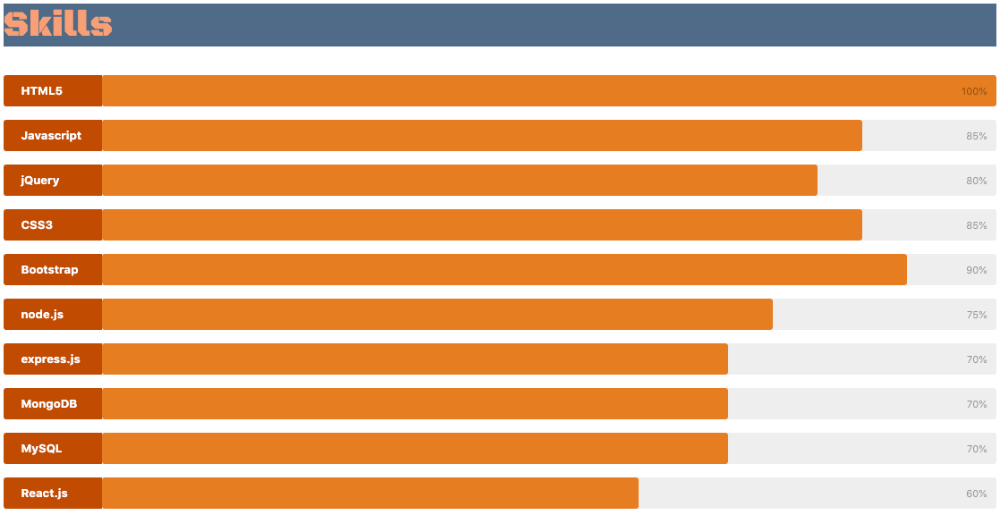
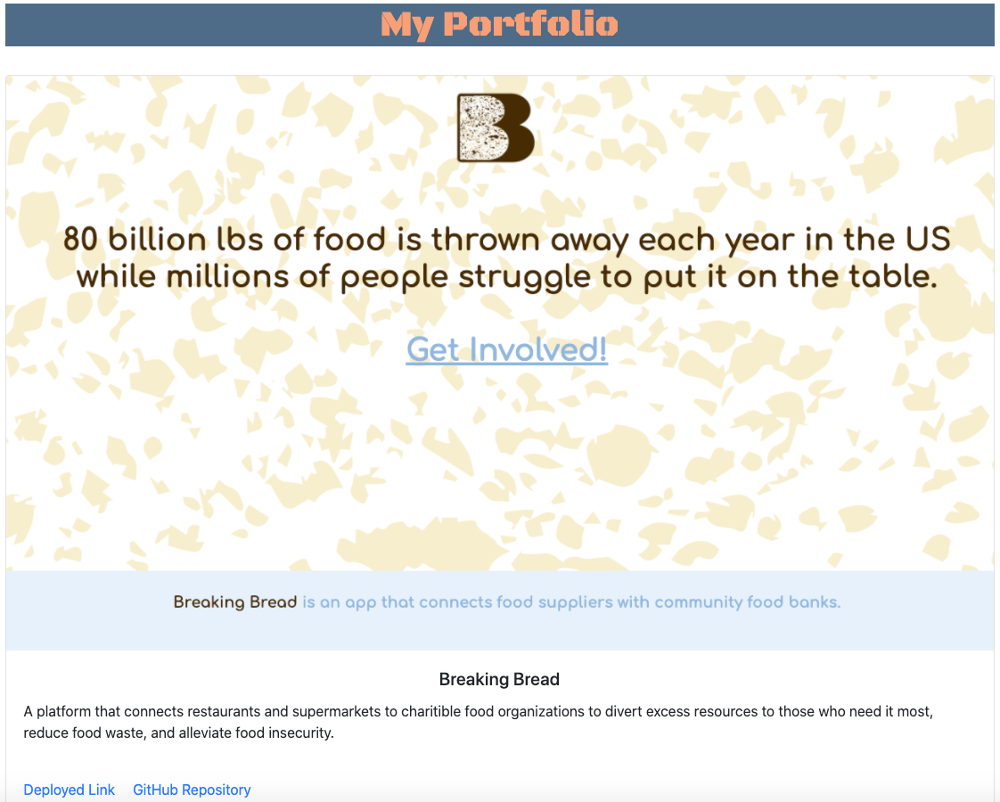

# React-Portfolio

## Description

  Welcome to my updated Portfolio page! This new page uses React.js to showcase my work, access contact information and give you a better overall picture of who I am as a developer. Please check out my website and feel free to reach out to me with any questions, comments or constructive criticism. I look forward to hearing from you!

  

  

  

  

  ## Table of Contents
  
  - [Installation](#installation)
  - [Testing](#tests)
  - [Usage](#usage)
  - [License](#license)
  - [Contributors](#contributors)
  - [Link to Deployed Application](#link)
  - [Questions](#questions)

  ## Installation

  - Run Command: npm run start

  ## Tests
  
  - Run Command: None

  ## Usage

  - This application was created using React.js. Please see installation instructions and tests for more information.

  ## License

  

  ## Contributors

  - None
  
  ## Link

  - https://kevin-smeraglio.herokuapp.com/

  ## Questions? 
  
  - Feel free to contact me at ksmera01@gmail.com